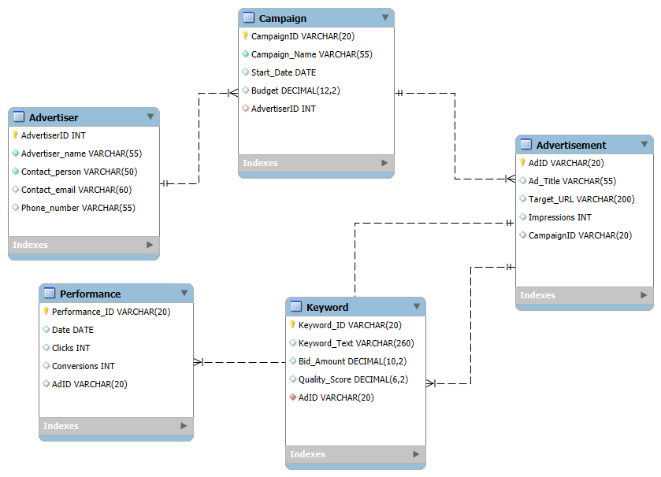

# Google-Ads-Database
Google is a multinational technology company offering online advertising services through the Google Ads platform. As a data analyst, you have been tasked with developing a comprehensive Relational Database Management System (RDBMS) to support Google Ads operations.The goal is to manage advertisers, campaigns, ads, keywords, and performance metrics.

## Objectives
* Identifying the main entities in the database system.
* Clearly defining the attributes, relationships and constraints that support the business needs.
* Designing an entity relationship diagram that supports the business needs based on the database entities, relationships and
participation constraints.

## Main Entities in the Database
Entities are tables or real world objects that are meant to store information in a database. They are the foundational components of an Entity Relationship Diagram (ERD). 

## Advertiser
This is the table that stores the advertisers' information. The attributes and data types are as follows:  

AdvertiserID **INT**  PK    
AdvertiserName  **VARCHAR**  
ContactPerson **VARCHAR**  
ContactEmail  **VARCHAR**  

## Campaign
This is the table that stores information from the campaigns. The attributes and data types are as follows:  

CampaignID **INT** PK  
AdvertiserID **INT**  FK  
CampaignName **INT**  
StartDate **INT**  
Budget **INT**  

## Ad

AdID **INT** PK  
CampaignID  FK **INT**  
AdTitle **TEXT**  
TargetURL **TEXT**  
Impressions **INT**  

## Keyword
KeywordID **INT** PK  
AdID **INT**  FK  
KeywordText **TEXT**  
BidAmount **INT**  
QualityScore **INT**  

## Performance

PerformanceID **INT** PK   
AdID **INT**  FK  
Date **DATE**  
Clicks **INT**  
Conversions **INT**  

## The Cardinality and Relationship Requirements for the Database
**Advertiser - Campaign:** One advertiser can manage multiple campaigns, but each campaign belongs to a single advertiser.  (one-to-many)  
**Campaign – Ad:** One campaign can contain multiple ads, but each ad is linked to one campaign.  (one-to-many)  
**Ad - Keyword:** An ad can target multiple keywords, but each keyword is associated with one ad.  (one-to-many)   
**Ad - Performance:** One ad can generate multiple performance records over time, but each performance record belongs to a specific ad. (one-to-many)   

## The Entity Relationship Diagram
The Entity Relationship Diagram shows the collection of objects within a database and the relationships between them. It included the entities, attributes, schemas, participation constraints and the relationships between the entities. I modelled this using the ERD tool in MySQL by adding tables, defining columns and specifying the relationships between the tables
using pre-existing columns as foreign keys.

## Inserting Data into the Database Using SQL Queries

## Advertiser Table

'''sql
insert into advertiser(advertiserid, advertisername, contactperson,contactemail,phonenumber)
VALUES (1, 'Simtech Creative', 'Chinwe okoro','Chinweokoro@gmail.com','+234 (0)70 4735 0000'),
(2, 'Gain Infinity - Digital Marketing Agency','Emeka IIbe', 'emekaibe@gmail.com','+234 (0)70 61839863'),
(3,'Business Digital Agency', 'Kehinde Adebayo', 'Kehindeadebayo@gmail.com','+234 (0)90 2726 9753'),
(4, 'Algorithm Media', 'Funke Adewale','Funkeadewale@gmail.com', '+234 (0)70 4735 0001'),
(5, 'Super Stars Promotions Limited', 'Ifeanyi Nwachukwu', 'IfeanyiNwackukwu@gmail.com','+234 (0)70 6183 9069'),
(6, 'Stanoz Designs', 'Ngozi obi', 'ngoziobi@gmail.com', '+234 (0)90 2726 9754'),
(7, 'Alternative Adverts ltd', 'Tolu Onifade', 'toluonifade@gmail.com','+234 (0)70 4735 0002'),
(8, 'Betteroffservice Advertising Agency','Bayo Alabi','bayoalabi@gmail.com', '+234 (0)70 6183 9070'),
(9, 'Odichi Solutions', 'Zainab Abdullahi', 'zainababdullahi@gmail.com', '+234 (0)90 2726 9755'),
(10, 'Gems Communication Ltd', 'Yakubu Danladi', 'yankubudanladi@gmail.com', '+234 (0)70 4735 0003'),
(11, 'Wetherheads, Advertising Group', 'Amara Umeh', 'amaraumeh@gmail.com', '+234 (0)70 6183 9071'),
(12, 'Adhubbing', 'Abdullahi Musa', 'abdullahimusa@gmail.com',  '+234 (0)90 2726 9756'),
(13, 'Ellae Creative', 'Esther Ogunleye', 'estherogunleye@gmail.com', '+234 (0)70 4735 0004');

